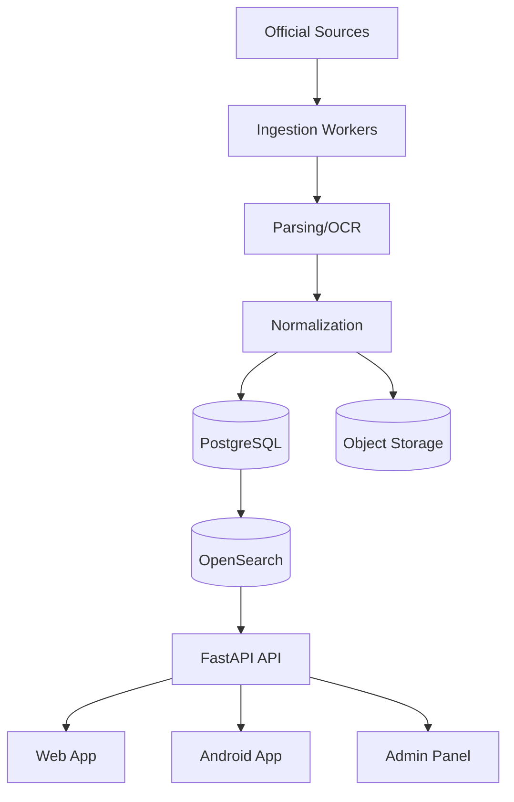

# System Architecture

## Layers
- Data ingestion
- Parsing and normalization
- Storage
- Search index
- API layer
- Web app
- Android app
- Admin panel

## Recommended stack
- Python 3.12
- FastAPI
- PostgreSQL
- Redis
- Celery
- OpenSearch or Elasticsearch
- Playwright
- BeautifulSoup
- pdfplumber
- PyMuPDF
- Tesseract OCR
- Docker

## Architecture pattern
Use event-driven ingestion with job queues and a separate search index.

## Mermaid diagram

